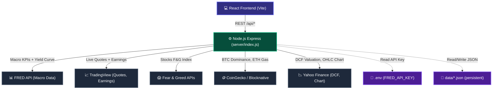
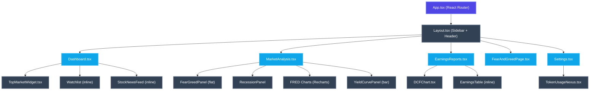

# Dashboard Architecture

## 1. System Architecture & Data Flow



## 2. Project Folder Structure

```
dashboard/
├── server/                     # Node.js backend
│   ├── index.js                # Express setup, mounts routes, starts pollers
│   ├── state.js                # Shared in-memory state, file paths, I/O helpers
│   ├── routes/
│   │   ├── market.js           # /api/market-data, /api/watchlist, /api/stock-news, /api/tickers, ...
│   │   ├── finance.js          # /api/valuation/:ticker, /api/chart/:ticker
│   │   └── fs.js               # /api/fs/*, /api/cron, /api/config-files
│   └── services/
│       ├── fred.js             # fetchFREDMacroData() — 11 macro series + yield curve
│       ├── fearAndGreed.js     # fetchFearAndGreedStocks/Crypto()
│       ├── crypto.js           # fetchCryptoMarketData(), fetchEthGas()
│       ├── quotes.js           # fetchTradingViewQuotes/Earnings(), refreshQuotes()
│       └── poller.js           # updateMarketDataFromAPIs() — runs every 5 min
│
├── src/                        # React frontend (TypeScript)
│   ├── App.tsx                 # React Router, all page routes
│   ├── pages/
│   │   ├── Dashboard.tsx       # Main hub
│   │   ├── MarketAnalysis.tsx  # FRED charts, Fear & Greed, Recession signals
│   │   ├── EarningsReports.tsx # DCF, EPS/Revenue history, timeline
│   │   ├── FearAndGreedPage.tsx
│   │   ├── MarketDebate.tsx
│   │   ├── AgentLogs.tsx
│   │   ├── TokenUsage.tsx
│   │   ├── Settings.tsx
│   │   └── Home.tsx
│   └── components/
│       ├── Layout.tsx
│       ├── FearAndGreedGauge.tsx
│       ├── DCFChart.tsx
│       ├── TokenUsageNexus.tsx
│       └── TopMarketWidget.tsx
│
├── data/                       # Persistent JSON store
│   ├── market-data.json        # Fear & Greed, FRED charts, macro KPIs
│   ├── watchlist.json          # Live watchlist with sparklines
│   └── stock-news.json         # Per-ticker AI analysis & sentiment
│
├── dist/                       # Production build output (npm run build)
├── public/
├── .env                        # FRED_API_KEY (not committed)
├── .env.example
├── package.json
├── vite.config.ts
└── tailwind.config.js
```

## 3. Frontend Component Tree



## 4. Market Analysis — Section Layout (top → bottom)

| Section | Data Source | Charts |
|---|---|---|
| Marktstimmung & Rezessionsrisiko | Fear & Greed APIs + FRED signals | Flat panel + signal list |
| Geldpolitik & Zinsen | FRED: FEDFUNDS, T10Y2Y, WALCL | Area + Line + Area |
| Inflation & Rohstoffe | FRED: CPIAUCSL, T10YIE, DCOILWTICO | Area + Area + Area |
| Konjunktur & Arbeitsmarkt | FRED: GDP, PAYEMS, UNRATE, ICSA, UMCSENT | Bar + Bar + Area + Area + Area |
| Zinsstrukturkurve | FRED: DGS1MO → DGS30 | Full bar snapshot |

## 5. FRED Series Reference

| Series ID | Description | Frequency |
|---|---|---|
| FEDFUNDS | Fed Funds Rate | Monthly |
| CPIAUCSL | CPI All Urban (YoY computed) | Monthly |
| UNRATE | Unemployment Rate | Monthly |
| T10Y2Y | 10Y–2Y Treasury Spread | Daily |
| PAYEMS | Non-Farm Payrolls (MoM change) | Monthly |
| A191RL1Q225SBEA | Real GDP Growth | Quarterly |
| UMCSENT | U. Michigan Consumer Sentiment | Monthly |
| T10YIE | 10Y Breakeven Inflation | Daily |
| WALCL | Fed Balance Sheet (trillions) | Weekly |
| ICSA | Initial Jobless Claims (thousands) | Weekly |
| DCOILWTICO | WTI Crude Oil | Daily |
| DGS1MO/3MO/6MO/1/2/3/5/7/10/20/30 | Yield Curve Snapshot | Daily |
